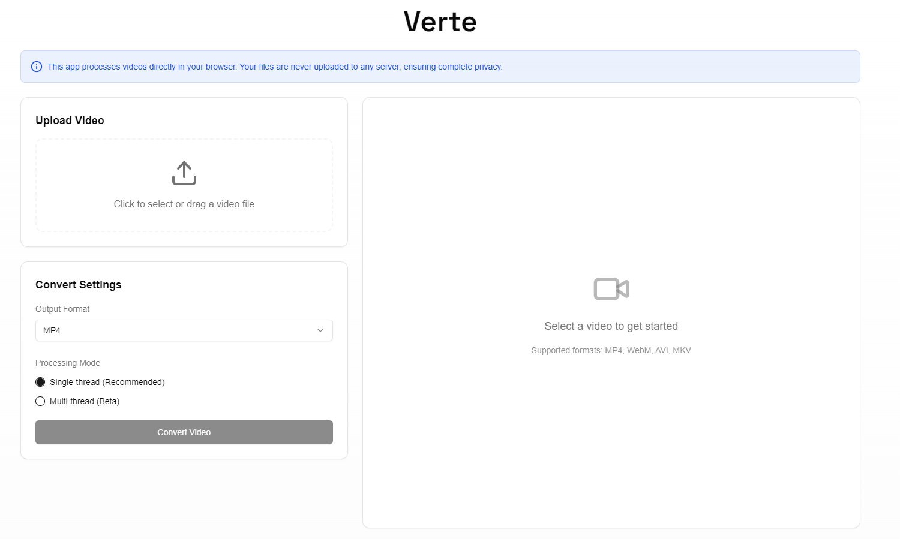

# Verte 

A simple video converter.



## Why?

Just wanted to play around with FFmpeg.wasm and see what's possible in the browser.

## What it does

- Converts videos between MP4, WebM, AVI, and MKV formats
- Works entirely in your browser - no server uploads
- Has a basic multi-thread support (experimental)
- Shows preview for MP4 and WebM formats

## Built with

- Next.js 15
- React
- TypeScript
- Tailwind CSS
- FFmpeg.wasm
- Shadcn/ui Components

## Try it out

1. Clone it:
```bash
git clone https://github.com/ahmetsarac/verte.git
```

2. Install Dependencies:
```bash
npm install
```

3. Run it:
```bash
npm run dev
```

4. Open [http://localhost:3000](http://localhost:3000) and convert some videos!

## Known Issues & Limitations

- It's pretty slow compared to regular FFmpeg
- Multi-thread mode is hit or miss (especially in Chrome)
- Browser support varies